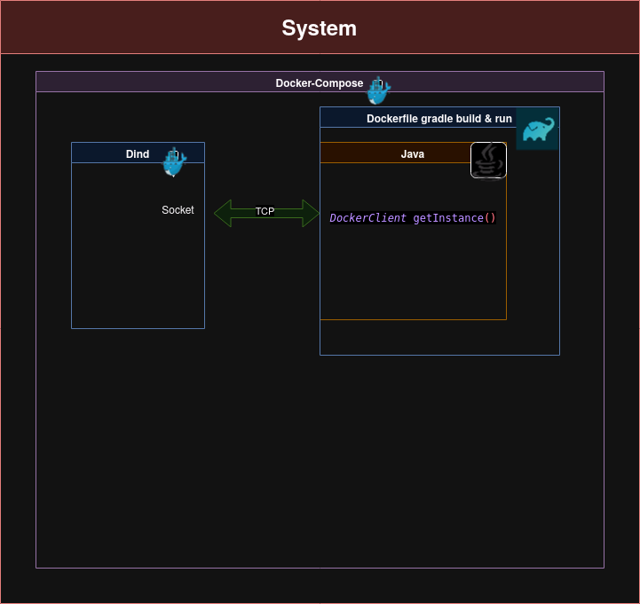

## Doel: 
docker containers op starten vanuit een docker container in java met dind 

## Probleem
Java kan niet aan de dind tcp socket

## Reeds geprobeerde oplossingen
### Oplossing 1: de socket mounten
Deze zou gewoon moeten werken door in de docker compose een volume aant te maken die de socket van mijn systeem mapt op die in de backend service. Dit heeft niet gewerkt en is daarenboven mijn minst favoriete oplossing.

### Oplossing 2:
Werken met docker-in-docker(dind), deze dind image deelt dan zijn docker socket via tcp, die toegangkelijk is vanuit onze backend service.
De relevante files hiervoor zijn:


Met de relevante snippets:

### getInstance()
hier gaan we de dockerhost zetten op de tcp poort van onze Dind service
```java
  public static synchronized DockerClient getInstance() {

    if (dockerClient == null) {
      DockerClientConfig config = DefaultDockerClientConfig.createDefaultConfigBuilder()
          .withDockerHost("tcp://dind:2375").build();
      DockerHttpClient httpClient = new ApacheDockerHttpClient.Builder()
          .dockerHost(config.getDockerHost())
          .sslConfig(config.getSSLConfig())
          .maxConnections(100)
          .connectionTimeout(Duration.ofSeconds(30))
          .responseTimeout(Duration.ofSeconds(45))
          .build();
      dockerClient = DockerClientImpl.getInstance(config, httpClient);
    }
    return dockerClient;
  }
```
### Docker-Compose
Hier gaan we de poort 2375 openzetten bij dind, dit is de poort die mapt op zijn socket
```yaml
    backend:
    container_name: spring_container
    build: backend/app/
    depends_on:
      - db
      - dind
    ports:
      - 8080:8080
    environment:
      - SPRING_DATASOURCE_URL=jdbc:postgresql://db:5432/postgres
      - SPRING_DATASOURCE_USERNAME=${PGU}
      - SPRING_DATASOURCE_PASSWORD=${PGP}
    restart: always
    volumes:
      - ./backend/app/data:/data:rw
    networks:
      - docker_network
  dind:
    container_name: dind
    image: docker:dind
    privileged: true
    ports:
      - 2375:2375
    networks:
      - docker_network
```
### erros:
```
41.61 DockerSubmissionTestTest > correctlyReceivesInputFiles() FAILED
41.61     java.lang.RuntimeException at ApacheDockerHttpClientImpl.java:195
41.61         Caused by: java.net.UnknownHostException at Inet6AddressImpl.java:-2
41.61 
41.61 DockerSubmissionTestTest > templateTest() FAILED
41.61     java.lang.RuntimeException at ApacheDockerHttpClientImpl.java:195
41.61         Caused by: java.net.UnknownHostException at InetAddress.java:801
```
Dit is wat de  met de zoals reeds beschreven implementatie teruggeven.
Ik vermoed dus dat er iets mis is met het addres van de socket, maar `tcp://dind:2375` zou normaal moeten werken aangezien ze op hetzelfde docker-netwerk zitten.

zo zou dit er in praktijk moeten uitzien:




