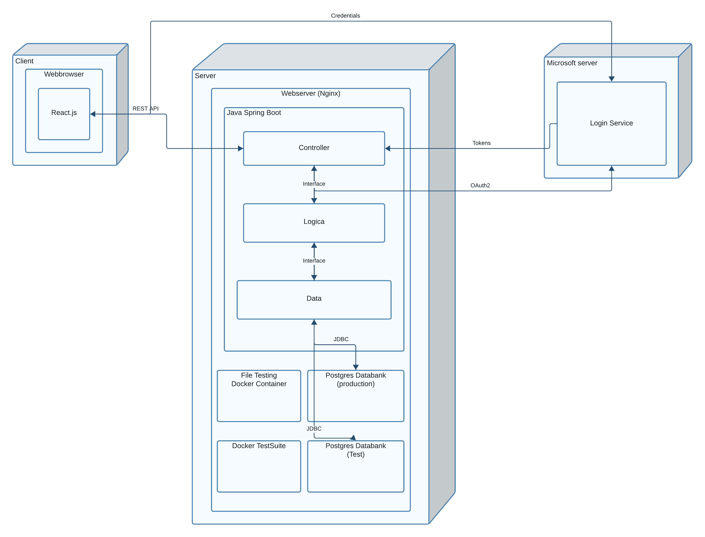

# Architectuur

### Een korte beschrijving van de architectuur van het project

Onze webservice zal een client-server architectuur aanbieden aan haar gebruikers. Gebruikers kunnen via hun webbrowser en een frontend ondersteunend op React.js ons platform betreden. Op de server draait een Nginx webserver die de communicatie met de applicatie mogelijk maakt.

We kozen voor Java Spring Boot als backend-framework. Ze bestaat uit een controller-, logica- en data-laag die elk sterk gescheiden zijn van elkaar. De controller behandelt de HTTP(S) requests en zorgt dat communicatie met clients mogelijk is aan de hand van een REST API. In de logica-laag zit de echte business code van het platform, en de data-laag dient om de communicatie met de relationele Postgres databases op een veilige manier te laten verlopen. Er zal een test en een production database zitten op de server.

Verder zullen er ook twee Docker omgevingen zijn: één om automatische testen uit te voeren telkens we de broncode van de applicatie zelf updaten, en een andere die het mogelijk maakt om ingediende oplossingen automatisch te laten verbeteren.

Ten slotte moeten gebruikers zich ook kunnen inloggen via hun Microsoft-account, Dit zal via de Microsoft Login Service gebeuren op een externe server. We zullen tokens en OAuth2 gebruiken om dit op een correcte manier af te handelen.
